# AcquaThermoNet — Technical documentation

Multi-zone heating controller for an 800×480 touch panel (ARM32 HMI).
It reads room temperatures from MQTT sensors, drives the zone valves through
a Modbus RTU relay board and appears in Home Assistant as one climate entity
per zone. Alarms and status also go to Telegram.

This document describes version **2.1.0**. The same content, with rendered
diagrams, is in [`AcquaThermoNet.html`](AcquaThermoNet.html). Telegram
setup: [`TELEGRAM.md`](TELEGRAM.md). Deployment package:
[`../tools/package/README.md`](../tools/package/README.md).

---

## Contents

1. [Overview](#1-overview)
2. [System architecture](#2-system-architecture)
3. [Software architecture](#3-software-architecture)
4. [Start and shutdown](#4-start-and-shutdown)
5. [MQTT interface](#5-mqtt-interface)
6. [Modbus RTU relay board](#6-modbus-rtu-relay-board)
7. [Thermoregulation](#7-thermoregulation)
8. [Frost protection](#8-frost-protection)
9. [Valve exercise](#9-valve-exercise)
10. [User interface](#10-user-interface)
11. [Outdoor weather](#11-outdoor-weather)
12. [Telegram](#12-telegram)
13. [Relay activity log](#13-relay-activity-log)
14. [Logging](#14-logging)
15. [Reliability](#15-reliability)
16. [Configuration reference](#16-configuration-reference)
17. [Files on the device](#17-files-on-the-device)
18. [Build](#18-build)
19. [Deployment package](#19-deployment-package)
20. [Testing and simulators](#20-testing-and-simulators)
21. [Troubleshooting](#21-troubleshooting)
22. [Known limitations and backlog](#22-known-limitations-and-backlog)

---

## 1. Overview

| | |
|---|---|
| Application | `AcquaThermoNet`, Qt 5 Widgets, C++17 |
| Target | ARM32 HMI (i5/i7 class), 800×480 touch, custom init (no systemd), launched by JMLauncher |
| Development | Linux x86_64, Qt 5.13.2 (Qt 5.15 also builds) |
| Zones | configurable list, up to 8 relays (`RELAY_NUM_MAX`) |
| Room sensors | "RoomSense" JSON over MQTT, one topic per zone |
| Actuators | 8-relay Modbus RTU board on RS485, device id 1 |
| Home Assistant | MQTT discovery, one `climate` entity per zone |
| Outdoor data | api.met.no (default) or wttr.in |
| Notifications | Telegram Bot API (long polling, no inbound port) |

Main features:

- on/off control with hysteresis per zone, minimum cycle time against short
  cycling, safe OFF when a sensor goes silent;
- setpoints from the panel (+/−) or Home Assistant, kept across restarts;
- relay feedback: the board is read back every 10 s, a relay that does not
  follow the commands is resent and then flagged as a fault;
- frost protection for zones without sensor data when it is cold outside;
- weekly valve exercise (anti-seize) for relays idle for a week;
- CSV log of every relay switch, daily/weekly ON time (Telegram, script);
- hardware watchdog, single instance, clean shutdown with relays confirmed OFF,
  restart loop on crash.

---

## 2. System architecture

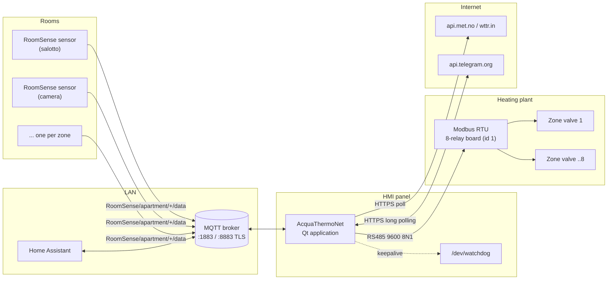

- The **sensors** publish on the broker; the application subscribes to them.
- **Home Assistant** shows and sets the zones only through the broker: it never
  talks to the panel directly, and the panel keeps regulating without it.
- The **relay board** is the only actuator; the application is the only
  master on the RS485 bus.
- **Internet** is optional: without it the weather is unknown (frost
  protection then protects by default) and Telegram messages are queued.

---

## 3. Software architecture

`ZoneModel` is the single source of truth for zone state. Every other
component changes it through its setters and reacts to its signals; none of
them holds zone state of its own.

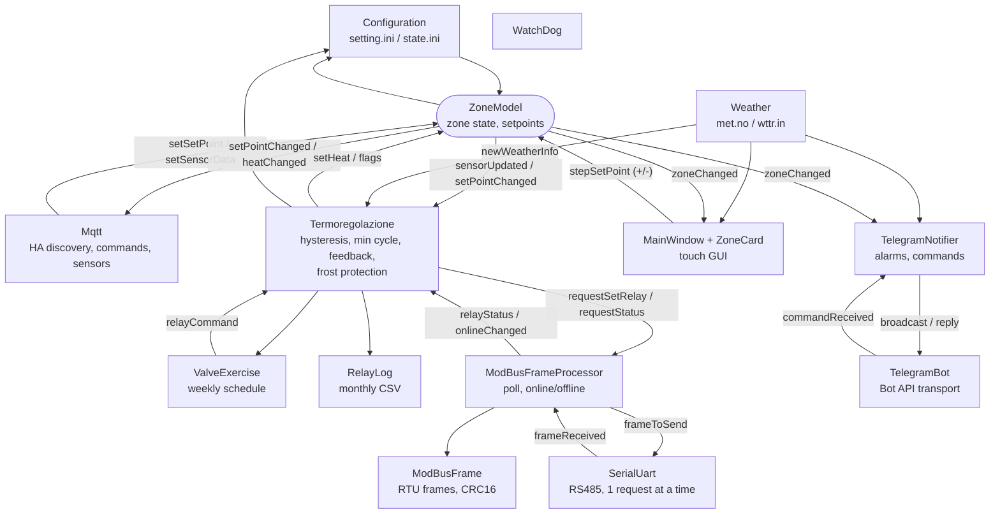

| Class | Files | Role |
|---|---|---|
| `Configuration` | `configuration.*` | Reads `setting.ini` (never writes it), reads/writes `state.ini`, validates values |
| `ZoneModel`, `ZoneData` | `zonemodel.*` | Zone state; setpoint rounding/clamping; debounced setpoint save |
| `Mqtt` | `mqtt.*` | Broker connection (plain/TLS), LWT, discovery, commands, sensor data |
| `MqttParse` | `mqttparse.*` | Pure topic/payload helpers (unit tested) |
| `Termoregolazione` | `termoregolazione.*` | Regulation, relay ownership, feedback check, frost protection, shutdown |
| `ValveExercise` | `valveexercise.*` | Anti-seize schedule and ON/OFF sequence |
| `ModBusFrameProcessor` | `modbusframeprocessor.*` | Relay write/read requests, 10 s poll, board online state |
| `ModBusFrame` | `modbusframe.*` | Modbus RTU frame build and CRC check |
| `SerialUart` | `serialuart.*` | RS485 transport, request queue, frame gap, reopen |
| `Weather` | `weather.*` | Outdoor weather poll |
| `TelegramBot` | `telegrambot.*` | `sendMessage` queue, `getUpdates` long polling, token redaction |
| `TelegramNotifier` | `telegramnotifier.*` | Alarm transitions, reminders, command answers |
| `RelayLog` | `relaylog.*` | Relay switch CSV, ON-time statistics |
| `MainWindow`, `ZoneCard` | `mainwindow.*`, `zonecard.*` | GUI, one card per zone, status bar |
| `WatchDog` | `watchdog.*` | `/dev/watchdog` keepalive, magic close |
| `SingleInstance` | `singleinstance.*` | One instance per target (abstract Unix socket) |
| `MonoClock` | `monoclock.*` | Monotonic time for every duration |
| `Logging` | `logging.*` | Categories, stderr + rotating file |
| `OpenSslPreload` | `opensslpreload.*` | Desktop Qt 5.13 only: loads the bundled OpenSSL 1.1 |

Everything runs in the main thread, event driven: serial I/O, network and
timers are all asynchronous Qt objects. A hang of the event loop stops the
watchdog refresh and reboots the board.

---

## 4. Start and shutdown

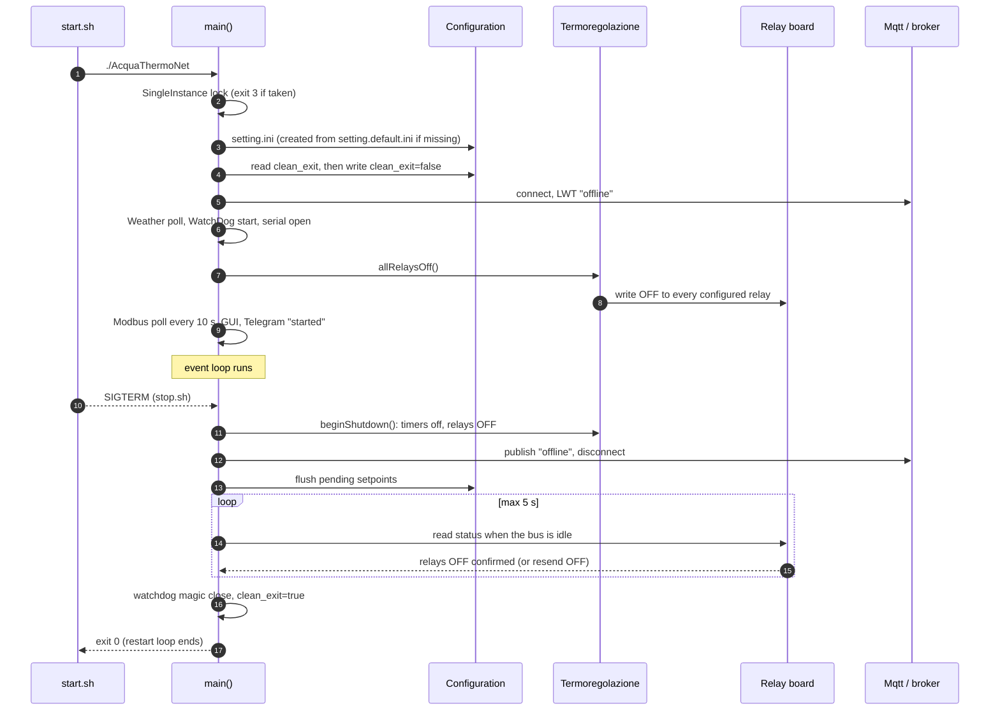

Start order (`main.cpp`):

1. `-V` / `--version` prints the banner and exits (no display needed).
2. Logging handler, `QApplication`.
3. `SingleInstance` lock: an abstract Unix socket named `AcquaThermoNet`; if
   taken, exit code **3**.
4. SIGTERM/SIGINT handler (self-pipe): the first signal quits the event loop
   cleanly, a second one kills.
5. `setting.ini` in the **current directory**, created from
   `setting.default.ini` if missing; `state.ini` next to it.
6. Log file, OpenSSL preload (desktop only).
7. Previous exit state read, then `clean_exit=false` written.
8. `ZoneModel`, `Mqtt`, `Weather`, `WatchDog`, `SerialUart`,
   `ModBusFrameProcessor`, `Termoregolazione`, `RelayLog`.
9. **All relays OFF** (safe state until the first valid sensor data).
10. Modbus poll every 10 s; GUI (full screen, frameless on the device);
    Telegram (if enabled) announces the start.

Shutdown: relays OFF and **confirmed by reading the board back** (resent if
still ON), MQTT `offline` published and disconnected, setpoints flushed,
Telegram "stopping" sent; at most 5 s of event processing. Then the watchdog
is disarmed and `clean_exit=true` is written. A missing confirmation is
logged (`Relays OFF not confirmed on exit`).

Exit codes, read by `start.sh`:

| Code | Meaning | start.sh |
|---|---|---|
| 0 | stopped on purpose (signal, clean shutdown) | loop ends |
| 3 | another instance already runs | loop ends |
| other / signal | crash | restart after 2, 4, 8, 16, 20 s |

---

## 5. MQTT interface

### 5.1 Connection

| | |
|---|---|
| Client id | `AcquaThermoNet-<unique_id>` |
| `unique_id` | `[MQTT] unique_id` if set; otherwise stored in `state.ini`; first run: MAC of the first Ethernet interface (no `:`), random if none |
| Auth | username/password only when both are set |
| Keepalive | 10 s |
| Will (LWT) | `AcquaThermoNet/status` = `offline`, QoS 1, retained |
| On connect | `AcquaThermoNet/status` = `online`, QoS 1, retained |
| Reconnect | backoff 1, 2, 5, 10, then 30 s |
| Publish | QoS 1, **retained**, for every message |
| Subscriptions | `homeassistant/status`, `AcquaThermoNet/#`, `RoomSense/apartment/#` (QoS 0) |
| TLS | optional, see 5.6 |

Discovery and subscriptions are sent at the first connection after a
disconnect; the setpoint and mode of every zone are republished with the
discovery.

### 5.2 Topics

`<zone>` is the zone name from `[ZONES] list` (letters, digits, `_`, `-`).

| Topic | Dir. | Payload | Retain | Notes |
|---|---|---|---|---|
| `AcquaThermoNet/status` | out | `online` / `offline` | yes | availability; `offline` also as LWT |
| `homeassistant/climate/<zone>/config` | out | discovery JSON (5.3) | yes | at connect and when HA comes online |
| `AcquaThermoNet/<zone>/state_temp` | out | setpoint, e.g. `20` or `20.5` | yes | after every setpoint command, also when clamped |
| `AcquaThermoNet/<zone>/state_mode` | out | `heat` / `off` | yes | heat demand of the zone |
| `AcquaThermoNet/<zone>/set_temp` | in | number, e.g. `21.5` | – | rounded to 0.5, clamped to 5…25 |
| `AcquaThermoNet/<zone>/set_mode` | in | `heat` / anything else = off | – | not advertised to HA, see §22 |
| `RoomSense/apartment/<zone>/data` | in | sensor JSON (5.4) | – | also HA `curr_temp_t` |
| `homeassistant/status` | in | `online` | – | HA restarted: republish discovery |

### 5.3 Home Assistant discovery

One `climate` entity per zone, named `clima.<zone>`. Example for zone
`salotto` with `unique_id` `001122aabbcc` (the application sends it compact;
keys come out in alphabetical order):

```json
{
  "avty_t": "AcquaThermoNet/status",
  "curr_temp_t": "RoomSense/apartment/salotto/data",
  "curr_temp_tpl": "{{ value_json.temperature }}",
  "device": {
    "identifiers": ["001122aabbcc_salotto"],
    "manufacturer": "Luigi Scagnet",
    "model": "AcquaThermoNet Ver 0.1",
    "name": "AcquaThermoNet"
  },
  "max_temp": "25",
  "min_temp": "5",
  "mode_stat_t": "AcquaThermoNet/salotto/state_mode",
  "modes": ["off", "heat"],
  "name": "clima.salotto",
  "temp_cmd_t": "AcquaThermoNet/salotto/set_temp",
  "temp_stat_t": "AcquaThermoNet/salotto/state_temp",
  "temp_step": "0.5",
  "uniq_id": "001122aabbcc_salotto"
}
```

| Abbreviation | HA option | Value |
|---|---|---|
| `avty_t` | `availability_topic` | `AcquaThermoNet/status` |
| `curr_temp_t` / `curr_temp_tpl` | `current_temperature_topic` / `_template` | the sensor topic, `temperature` field |
| `temp_cmd_t` | `temperature_command_topic` | `…/set_temp` |
| `temp_stat_t` | `temperature_state_topic` | `…/state_temp` |
| `mode_stat_t` | `mode_state_topic` | `…/state_mode` |
| `modes` | `modes` | `off`, `heat` |
| `min_temp` / `max_temp` / `temp_step` | | 5 / 25 / 0.5 (`TEMP_MIN`, `TEMP_MAX`, `TEMP_STEP`) |

The mode shown in HA is the **heat demand** (`heat` while the zone asks for
heat, `off` when satisfied): HA cannot switch it, there is no
`mode_command_topic`.

### 5.4 Sensor payload (RoomSense)

```json
{
  "temperature": 20.4,
  "humidity": 48,
  "battery": 85,
  "battmv": 2950,
  "data_time": 1790596805,
  "mac": "A4:C1:38:00:11:22"
}
```

| Field | Required | Type | Use |
|---|---|---|---|
| `temperature` | **yes** | number or numeric string | regulation, GUI, HA |
| `humidity` | no | number/string | GUI, Telegram |
| `battery` | no | number/string, % | GUI, alarm below 20 % (Telegram OK again from 30 %) |
| `battmv` | no | number/string, mV | stored |
| `data_time` | no | number/string, epoch | stored |
| `mac` | no | string | stored |

A message without a valid `temperature`, or not a JSON object, is rejected
and logged (`Invalid sensor data for zone …`); missing optional fields keep
their previous value. Every valid message resets the zone sensor timeout.
Messages for zones not in `[ZONES] list` are ignored.

### 5.5 Message flows

Setpoint from Home Assistant:

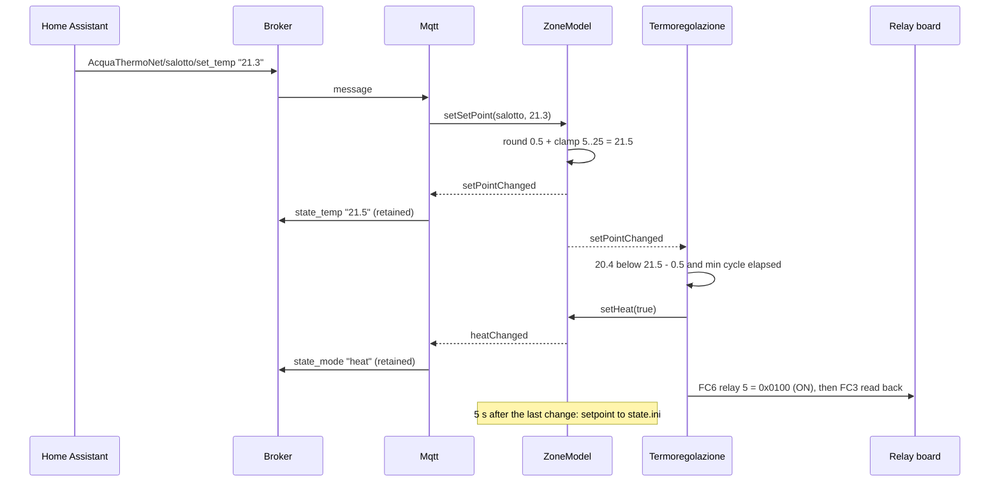

Sensor reading:

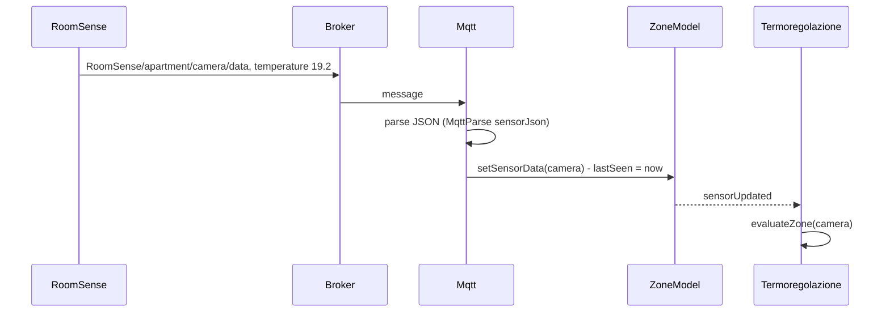

### 5.6 TLS

`[MQTT] tls=true` (usually with `broker_port=8883`):

- `ca_file`: PEM CA of the broker; empty = system CAs;
- `cert_file` + `key_file`: optional client certificate (RSA or EC key);
- `tls_verify=false`: no certificate check (tests only, logged as a warning);
- `peer_name`: name to verify when `broker_addr` is an IP;
- relative paths are relative to `setting.ini`.

The TLS socket is opened by the application and handed to QtMqtt (works with
QtMqtt 5.13); connection + handshake time out after 15 s and retry with the
same backoff. An invalid TLS configuration (unreadable CA, cert or key) stops
the MQTT connection altogether: it never falls back to plain TCP.

### 5.7 Command-line examples

```sh
# everything the application publishes and receives
mosquitto_sub -h <broker> -u <user> -P <password> -v \
  -t 'AcquaThermoNet/#' -t 'homeassistant/climate/#' -t 'RoomSense/apartment/#'

# set a zone setpoint (what HA does)
mosquitto_pub -h <broker> -u <user> -P <password> \
  -t AcquaThermoNet/salotto/set_temp -m 21.5

# simulate a sensor
mosquitto_pub -h <broker> -u <user> -P <password> \
  -t RoomSense/apartment/salotto/data \
  -m '{"temperature":"19.2","humidity":"50","battery":"90"}'

# force HA discovery again
mosquitto_pub -h <broker> -u <user> -P <password> -t homeassistant/status -m online
```

---

## 6. Modbus RTU relay board

### 6.1 Line

| | |
|---|---|
| Interface | RS485 half duplex, kernel RS485 mode (`TIOCSRS485`, RTS on send) |
| Format | `[SERIAL] baud` (default 9600), 8N1, no flow control |
| Device id | 1 |
| Requests | one at a time: the next is sent when the answer is complete |
| End of answer | line silent for 50 ms |
| Answer timeout | 1000 ms, then the next request is sent |
| Port lost / not openable | retried every 10 s, pending requests dropped |

### 6.2 Registers

| Register | Access | Value |
|---|---|---|
| 1…8 (holding) | FC6 write | `0x0100` = relay ON, `0x0200` = relay OFF |
| 1…8 (holding) | FC3 read | low byte ≠ 0: relay ON |

Relay *n* is register *n*. Register 0 is never written: a zone without a
valid `relaynum` has no relay.

### 6.3 Frames

All values big endian, CRC16 Modbus (poly 0xA001, init 0xFFFF) sent low
byte first.

Read the 8 relays (every 10 s, and after every write):

```
01 03 00 01 00 08 15 CC
│  │  └─┬─┘ └─┬─┘ └─┬─┘
│  │    │     │     CRC
│  │    │     count = 8
│  │    start register 1
│  FC3 read holding registers
device 1
```

Answer (relay 5 ON, the others OFF), 21 bytes:

```
01 03 10 00 00 00 00 00 00 00 00 00 01 00 00 00 00 00 00 F4 99
         └reg1┘└reg2┘└reg3┘└reg4┘└reg5┘└reg6┘└reg7┘└reg8┘ CRC
```

Relay 5 ON / OFF:

```
01 06 00 05 01 00 98 5B      FC6 register 5 = 0x0100 (ON)
01 06 00 05 02 00 98 AB      FC6 register 5 = 0x0200 (OFF)
```

Only a 21-byte FC3 answer with a valid CRC is used; write echoes are ignored.

### 6.4 Online state and relay feedback

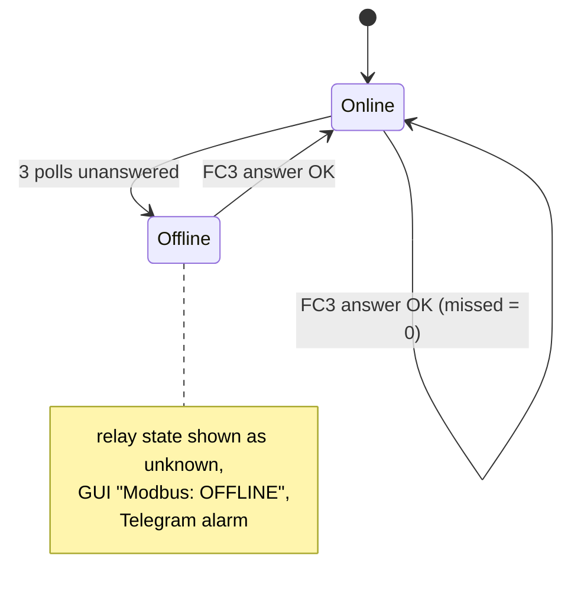

Every read-back is compared with the last command of each zone:

- ignored for 3 s after a command (relay settle time);
- mismatch: the command is resent (logged as warning, up to 3 times);
- 4th consecutive mismatch: **relay fault** (critical log, red card,
  Telegram alarm); the command keeps being resent;
- a matching read clears the fault.

---

## 7. Thermoregulation

### 7.1 Rule

For each zone with a fresh sensor reading *T* and setpoint *SP*:

- **ON** when *T* < *SP* − 0.5 (`TEMP_HYST`);
- **OFF** when *T* > *SP*;
- no change in between.

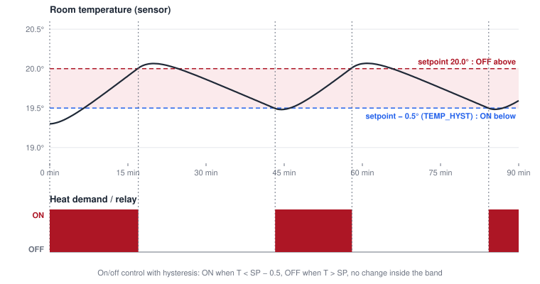

| Constant | Value | Where |
|---|---|---|
| `TEMP_HYST` | 0.5 °C | `climatezones.h` |
| `TEMP_STEP` | 0.5 °C (setpoint step, +/− buttons) | `climatezones.h` |
| `TEMP_MIN` / `TEMP_MAX` | 5 / 25 °C (setpoint range) | `climatezones.h` |
| `TEMP_DEFAULT` | 18 °C (zone without setpoint) | `climatezones.h` |
| `min_cycle_s` | 180 s (0 = off) | `[REGULATION]` |
| `sensor_timeout_s` | 900 s | `[REGULATION]` |
| periodic refresh | 60 s (re-evaluates and resends every relay) | `termoregolazione.cpp` |
| relay settle | 3000 ms | `RegulationConfig::relaySettleMs` |

### 7.2 Zone evaluation

A zone is evaluated when its sensor sends data, when its setpoint changes,
every 60 s (forced: the relay command is sent again even if unchanged), when
the outdoor temperature changes and at the edges of the frost cycle.

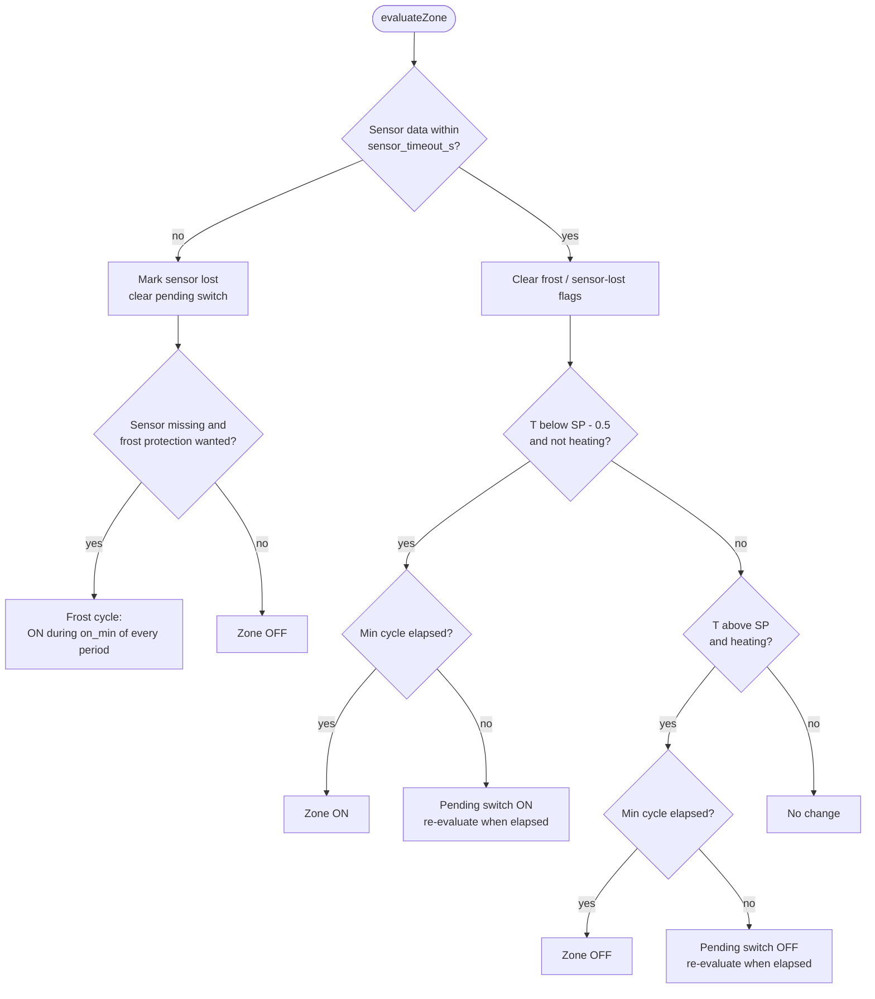

### 7.3 Minimum cycle

A real ON↔OFF change of a zone waits until `min_cycle_s` have passed since
its previous change (protects valves and pump against short cycling). The
switch is then *pending*: shown on the card (`switch ON in 2 min`) and in
Telegram `/zone`, and the zone is evaluated again as soon as the time is
over. Safety OFFs (sensor lost, startup, shutdown) never wait. Resending the
same state does not count as a switch.

### 7.4 Sensor timeout

No valid data for `sensor_timeout_s`: the zone goes **OFF** (or into frost
protection, §8), the card shows `NO SENSOR <age>` and Telegram sends an
alarm. A zone never heard since the start is treated as missing once
`sensor_timeout_s` has passed since the start. The zone recovers with the
next valid reading.

### 7.5 Shared relays

Several zones may use the same relay (a warning is logged). The relay log
names them joined by `+` (e.g. `camera+bagno`). Every zone command drives the
relay, so the last evaluated zone wins: avoid it unless the zones are
effectively one.

### 7.6 Setpoints

- Changed from the panel (+/− buttons, 0.5 °C) or HA `set_temp`.
- Rounded to 0.5 and clamped to 5…25 °C; the result is always republished on
  `state_temp`, so HA shows the value really used.
- Written to `state.ini` 5 s after the last change (several taps = one flash
  write) and at shutdown; `setting.ini` keeps only the initial value.
- At start: `state.ini` value if present, otherwise `setting.ini`.

---

## 8. Frost protection

For zones **without sensor data** (lost, or never seen since the start)
while it is cold outside: instead of staying OFF, the zone heats `on_min`
minutes every `period_min` minutes.

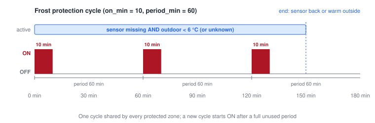

Frost protection is wanted when `[FROST_PROTECTION] enabled` and:

- the outdoor temperature is **below** `outdoor_below` (default 6 °C), or
- there is no outdoor data, or it is older than `outdoor_max_age_min`
  (180 min), and `outdoor_unknown_protect=true` (fail safe: no weather must
  not freeze pipes).

One cycle is shared by all protected zones. A new cycle (starting with the
ON part) begins when the protection was not used for a whole period. A
timer wakes the regulation at each ON/OFF edge. `on_min` longer than
`period_min` is reduced to the period.

Signalled as `FROST MODE` on the card, Telegram alarm, relay log reason
`frost`. It ends as soon as the zone sensor sends data again, or when the
outdoor temperature rises above the threshold.

---

## 9. Valve exercise

Zone valves that stay closed for months (summer) can seize. Once a week the
relays **idle for `idle_days`** are cycled ON/OFF.

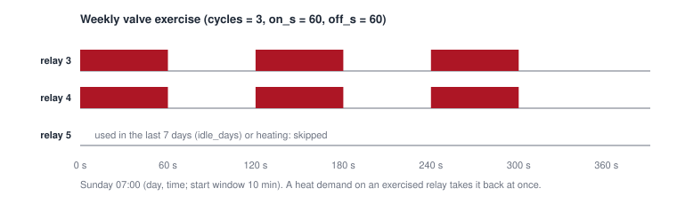

- When: `day` (`monday`…`sunday`, at least 3 letters, or 1…7) at `time`
  (`H:mm`, local time), within a 10 minute window, once per date. Checked
  every 30 s.
- Which relays: configured relays not ON for `idle_days` (default 7) and not
  heating now. The last ON of each relay is kept in `state.ini`
  (`[RELAYS] <n>\last_on`, saved at most once per hour per relay).
- Sequence: `cycles` × (`on_s` ON, `off_s` OFF); relays end OFF.
- A heat demand on an exercised relay takes it back immediately; shutdown
  aborts the exercise.
- Needs the wall clock: skipped while the date is before 2024 (board without
  RTC before NTP). A relay without history counts as used "now", so the
  first exercise comes after `idle_days`, not at first start.
- Card status `valve exercise`, relay log reason `exercise`.

---

## 10. User interface

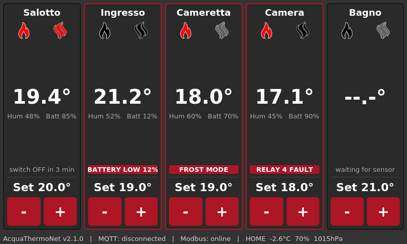

*Rendered by `tools/guishot` with one zone per state: pending switch,
battery low, frost mode, relay fault, waiting for data.*

Each card, top to bottom:

| Element | Meaning |
|---|---|
| name | zone name, first letter capitalized |
| flame icon | red = heat demand |
| radiator icon | relay state read from the board: red = ON, black = OFF, dimmed = unknown (board offline, no relay) |
| temperature | last reading, `--.-°` before the first |
| Hum / Batt | humidity and battery of the sensor |
| status line | the most important condition (below); red with red border for alarms |
| Set | setpoint |
| − / + | setpoint −/+ 0.5 °C |

Status line, by priority:

| Status | Alarm | Condition |
|---|---|---|
| `RELAY n FAULT` | yes | relay does not follow the commands |
| `FROST MODE` | yes | frost protection active |
| `NO SENSOR <age>` | yes | sensor timeout |
| `waiting for sensor` | no | no data since the start |
| `BATTERY LOW n%` | yes | battery below 20 % |
| `valve exercise` | no | relay being exercised |
| `switch ON/OFF in <t>` | no | switch waiting for the min cycle |
| `no relay - updated <age>` | no | zone without relay |
| `updated <age>` | no | normal |

Status bar: `AcquaThermoNet v<version> | MQTT: connected/connecting/disconnected |
Modbus: online/OFFLINE/port closed | <LOCATION> <temp>°C <hum>% <press>hPa`.

Cards refresh every 5 s (ages and countdowns) and on every change. On the
device the window is full screen, frameless and on top; style sheet
`qss/default.qss`, designed for 800×480 with 5 zones.

---

## 11. Outdoor weather

| Provider | `[WEATHER] provider=` | Request |
|---|---|---|
| met.no | `metno` | `https://api.met.no/weatherapi/locationforecast/2.0/compact?lat=…&lon=…&altitude=…` |
| wttr.in | `wttr` (code default) | `https://wttr.in/<location>?format="%l:+%t+%h+%w+%p+%P+%T"&M` |

met.no terms of service are followed: `User-Agent: AcquaThermoNet/<version> <contact>`,
no request before the `Expires` of the previous answer, `If-Modified-Since`
(a `304` keeps the current data), coordinates with 4 decimals. Polled every
`poll_s` (min 60 s).

Used for: the status bar, the frost protection threshold (§8), Telegram
`/status`. From met.no: first time step, `air_temperature`,
`relative_humidity`, `air_pressure_at_sea_level`, `wind_speed`, next hour
`precipitation_amount`.

---

## 12. Telegram

Summary; setup and details in [`TELEGRAM.md`](TELEGRAM.md).

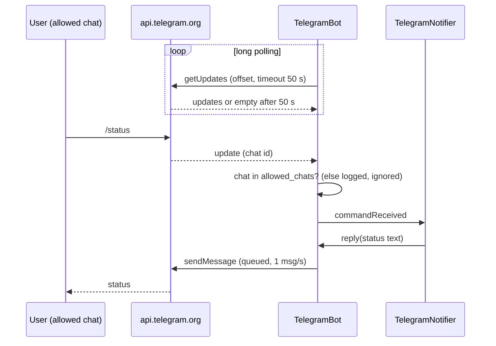

Messages look like `⚠️ [Casa 14:05] Salotto: no sensor data, zone OFF.`

| Alarm (on start / on end) | Source |
|---|---|
| sensor lost / back | zone sensor timeout |
| relay fault / OK | relay feedback |
| frost mode on / off | frost protection |
| battery low (< 20 %) / OK (≥ 30 %) | sensor battery |
| Modbus board offline / online | 3 missed polls |
| serial port lost / open | `SerialUart` |
| MQTT not connected for `mqtt_down_min` / back | broker connection |
| start (with warning after an unclean stop), stop | application |

Still active alarms are repeated every `reminder_h` hours. Commands (read
only): `/status`, `/zone <name>`, `/today`, `/week`, `/help`.

Transport: messages are queued (max 200) and retried while the network is
down (backoff 5, 10, 30, 60 s; HTTP 429 waits `retry_after`; other 4xx drop
the message). The token is part of every URL and is removed from every
logged text.

---

## 13. Relay activity log

`[RELAY_LOG] file=log/relays.csv` writes one line per relay state change, one
file per month (`log/relays-2026-09.csv`), kept for `keep_months` (24).

```csv
time,epoch,relay,zones,state,reason,on_s
2026-09-29T14:00:05+02:00,1790596805,5,salotto,ON,regulation,
2026-09-29T14:42:10+02:00,1790599330,5,salotto,OFF,regulation,2525
```

| Column | |
|---|---|
| `time` | local time with UTC offset (unambiguous across DST) |
| `epoch` | Unix seconds |
| `relay` | 1…8 |
| `zones` | zone(s) using the relay, `+` separated |
| `state` | `ON` / `OFF` |
| `reason` | `regulation`, `frost`, `exercise`, `no_sensor`, `startup`, `shutdown` |
| `on_s` | on OFF lines: seconds the relay was ON (monotonic clock); empty if the ON was not seen |

Used by Telegram `/today`, `/week`, `/zone`, and by the offline script:

```sh
tools/relaystats.py log/ --from 2026-09-01 --to 2026-09-30 \
    --reason regulation,frost --csv daily.csv --plot daily.png
```

It rebuilds the ON intervals, splits them at midnight and sums them per day
and zone (stacked bar chart with matplotlib). An ON without OFF (power loss)
is closed at the next line of that relay and reported as "unclosed".

---

## 14. Logging

Format: `2026-09-30 08:48:12.345 I atn.regulation: message`
(level `D`/`I`/`W`/`C`/`F`).

| Category | Content |
|---|---|
| `atn.app` | start, shutdown, watchdog, single instance, OpenSSL |
| `atn.config` | configuration, invalid values, setpoint saves |
| `atn.mqtt` | broker, TLS, discovery, invalid payloads |
| `atn.modbus` | serial port, answer timeouts, board online/offline |
| `atn.regulation` | switches, timeouts, frost, exercise, relay faults, relay log |
| `atn.weather` | weather requests |
| `atn.telegram` | bot, commands, chats not allowed |

- stderr always; file `[LOG] file` (default `log/AcquaThermoNet.log`) for
  info and above, rotated at `max_kb` into `.1` … `.<files>`.
- Debug is off by default and never written to the file (flash):
  `QT_LOGGING_RULES="atn.modbus.debug=true"`.
- Release builds drop `qDebug` output (`QT_NO_DEBUG_OUTPUT`).
- Secrets: the Telegram token is redacted; the MQTT password is never logged.

---

## 15. Reliability

| Mechanism | What it covers |
|---|---|
| Hardware watchdog | `/dev/watchdog`, refreshed every timeout/4 by the event loop: a hang reboots the board. Disarmed ("magic close" `V`) only after a clean shutdown |
| Restart loop | `start.sh` restarts the application after a crash (2→20 s backoff) |
| Single instance | abstract Unix socket `AcquaThermoNet`: a second instance exits 3 without touching the hardware |
| Safe state | relays OFF at start (until valid data), on sensor timeout, at shutdown (confirmed by read-back) |
| `clean_exit` | `state.ini [APP] clean_exit=false` while running: the next start knows about a crash/power loss/watchdog reset (Telegram warning) |
| Monotonic clock | every duration (timeouts, min cycle, ON time) uses `CLOCK_MONOTONIC`: immune to NTP jumps (1970 → today) and manual clock changes |
| Wall clock guard | valve exercise and relay history ignored while the date is before 2024 |
| Flash safety | `state.ini` written with `sync()`; setpoint writes debounced 5 s; debug not logged to file; relay history at most hourly |
| Serial | port reopened every 10 s; relays resynced when it reopens |
| MQTT | LWT, backoff reconnect, discovery again when HA restarts; TLS never downgrades |
| Network | Telegram queue survives outages; met.no cache headers respected |

---

## 16. Configuration reference

`setting.ini` is written **only by hand**; the application creates it from
`setting.default.ini` at the first start and never changes it. Relative
paths are relative to `setting.ini`. Invalid values are logged and replaced
by the default. Restart the application after a change.

### [MQTT]

| Key | Default | |
|---|---|---|
| `broker_addr` | `localhost` | broker host or IP |
| `broker_port` | `1883` | `8883` usually with TLS |
| `broker_uname`, `broker_password` | – | used only if both set (plain text) |
| `unique_id` | MAC / stored | fixed id for client id and HA entities |
| `tls` | `false` | |
| `ca_file` | system CAs | PEM |
| `cert_file`, `key_file` | – | PEM client certificate and key |
| `tls_verify` | `true` | `false` for tests only |
| `peer_name` | `broker_addr` | name in the broker certificate |

### [ZONES] and [RELAY]

| Key | Default | |
|---|---|---|
| `[ZONES] list` | – | zone names, comma separated, order = card order. `[A-Za-z0-9_-]`, not `list`; invalid or duplicated names are skipped |
| `[ZONES] <zone>\setpoint` | 18 | initial setpoint (then `state.ini`) |
| `[RELAY] <zone>\relaynum` | none | relay 1…8; missing/invalid = zone without relay |

### [SERIAL]

| Key | Default | |
|---|---|---|
| `port` | `com1` | serial port name or device path |
| `baud` | `9600` | 8N1 always |

### [REGULATION]

| Key | Default | |
|---|---|---|
| `min_cycle_s` | 180 | min time between two switches of a zone, 0 = off |
| `sensor_timeout_s` | 900 | no data for this long: zone OFF / frost |

### [FROST_PROTECTION]

| Key | Default | |
|---|---|---|
| `enabled` | `true` | |
| `outdoor_below` | 6 | °C, strictly below |
| `on_min` | 10 | ON minutes per period |
| `period_min` | 60 | |
| `outdoor_max_age_min` | 180 | older outdoor data counts as unknown |
| `outdoor_unknown_protect` | `true` | unknown outdoor = protect |

### [VALVE_EXERCISE]

| Key | Default | |
|---|---|---|
| `enabled` | `true` | |
| `day` | `sunday` | `monday`…`sunday` (≥ 3 letters) or 1…7 |
| `time` | `07:00` | local time, `H:mm` |
| `cycles` | 3 | |
| `on_s` / `off_s` | 60 / 60 | |
| `idle_days` | 7 | only relays not used for this long |

### [WEATHER]

| Key | Default | |
|---|---|---|
| `provider` | `wttr` | `metno` or `wttr` |
| `location` | – | name shown; wttr.in place (required for wttr) |
| `lat`, `lon` | – | required for metno |
| `altitude` | 0 | m, metno |
| `contact` | – | e-mail/URL in the met.no User-Agent (asked by met.no) |
| `poll_s` | 600 | min 60 |

### [LOG]

| Key | Default | |
|---|---|---|
| `file` | – (none) | e.g. `log/AcquaThermoNet.log` |
| `max_kb` | 512 | min 16 |
| `files` | 3 | rotated files kept |

### [TELEGRAM]

| Key | Default | |
|---|---|---|
| `enabled` | `false` | disabled anyway without token or allowed chats |
| `token` | – | from @BotFather (plain text) |
| `allowed_chats` | – | chat ids, comma separated (groups are negative) |
| `name` | `AcquaThermoNet` | message prefix |
| `reminder_h` | 6 | repeat active alarms, 0 = off |
| `mqtt_down_min` | 10 | min 1 |
| `api_url` | `https://api.telegram.org` | tests only |

### [RELAY_LOG]

| Key | Default | |
|---|---|---|
| `file` | – (disabled) | e.g. `log/relays.csv` → `log/relays-YYYY-MM.csv` |
| `keep_months` | 24 | |

### Example

```ini
[MQTT]
broker_addr=<broker host or IP>
broker_port=1883
broker_uname=<user>
broker_password=<password>

[ZONES]
list=salotto, camera, bagno
salotto\setpoint=20
camera\setpoint=18
bagno\setpoint=21

[RELAY]
salotto\relaynum=5
camera\relaynum=4
bagno\relaynum=1

[SERIAL]
; device dependent
port=/dev/ttyS1
baud=9600

[WEATHER]
provider=metno
location=home
lat=<latitude>
lon=<longitude>
altitude=<metres>
contact=<e-mail or URL>

[LOG]
file=log/AcquaThermoNet.log

[RELAY_LOG]
file=log/relays.csv

[TELEGRAM]
enabled=true
token=<bot token>
allowed_chats=<chat id>
name=Casa
```

### state.ini (written by the application)

| Key | |
|---|---|
| `[MQTT] unique_id` | generated id, kept so HA entities survive MAC changes |
| `[ZONES] <zone>\setpoint` | last setpoint, overrides `setting.ini` |
| `[RELAYS] <n>\last_on` | epoch of the last activation (valve exercise) |
| `[APP] clean_exit` | `false` while running |

Do not deploy `state.ini`; delete it to go back to the `setting.ini`
setpoints (and a new `unique_id` = new HA entities, unless fixed in
`setting.ini`).

---

## 17. Files on the device

Installation folder of the package (`installationFolder` `AcquaThermoNet`;
`make install` uses `/mnt/data/hmi/AcquaThermoNet/`):

```
AcquaThermoNet/
├── AcquaThermoNet            binary
├── setting.default.ini       template (package)
├── setting.ini               device configuration (by hand, kept on update)
├── state.ini                 application state (kept on update)
├── package.info              JMLauncher descriptor
├── run.sh start.sh stop.sh   lifecycle
├── install.sh uninstall.sh update.sh
└── log/
    ├── AcquaThermoNet.log    (.1 .2 .3 rotated)
    └── relays-YYYY-MM.csv
```

The working directory is the package folder (`start.sh` changes to it):
`setting.ini`, `state.ini` and relative log paths are resolved from there.

---

## 18. Build

### 18.1 Toolchains

| Target | Qt | Notes |
|---|---|---|
| Desktop x86_64 | 5.13.2 (`/home/devel/Sviluppi/Qt/5.13.2`) | OpenSSL 1.1.1w built from the submodule and preloaded |
| Desktop x86_64 | 5.15.x | optional, uses the system OpenSSL 3 |
| Device ARM32 | SDK 1.3.x (`cortexa7hf-neon-poky-linux-gnueabi`) | QtSerialPort and OpenSSL 1.1 from the SDK |

### 18.2 Project layout

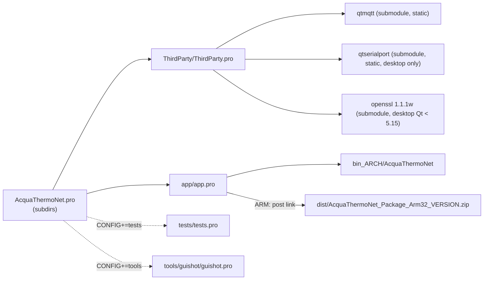

- `ThirdParty` builds the missing Qt modules from the git submodules at
  v5.13.2 as **static** libraries (QtMqtt always, QtSerialPort only if the Qt
  in use lacks it), only when the library is missing.
- Sources are in the repository root; `.qmake.conf` defines `ATN_SRC` and
  `ATN_BUILD` for every sub-project.

### 18.3 Commands

```sh
git submodule update --init

# desktop
mkdir build-desktop && cd build-desktop
/home/devel/Sviluppi/Qt/5.13.2/bin/qmake ../AcquaThermoNet.pro
make -j4
./bin_x86_64/AcquaThermoNet --version

# device (the package zip is built after the link)
source /home/devel/Sviluppi/Sdk/1.3.x/environment-setup-cortexa7hf-neon-poky-linux-gnueabi
mkdir build-arm && cd build-arm
qmake ../AcquaThermoNet.pro
make -j4
ls dist/
```

| qmake option | Effect |
|---|---|
| `CONFIG+=tests` | also build the unit tests (`<build>/tests/tests`) |
| `CONFIG+=tools` | also build `guishot` (desktop) |
| `CONFIG+=package` | desktop: build the package zip too |
| `CONFIG+=nopackage` | ARM: skip the package zip |

### 18.4 Version

Taken from the latest git tag `vX.Y.Z` when qmake runs (`version.pri` →
generated `version.h`):

| Build | Version |
|---|---|
| exactly at tag `v2.1.0` | `2.1.0` |
| commits after the tag | `2.1.0-<short hash>` |
| no git / no tag | `0.0.0` |

Banner: `AcquaThermoNet v2.1.0 (git 1a2b3c4, built 2026-09-30 06:48:12 UTC)`
(`-dirty` with uncommitted changes). Release: `git tag -a v2.1.0 -m v2.1.0`,
then rerun qmake.

### 18.5 OpenSSL on the desktop

Qt 5.13 loads OpenSSL 1.1 at run time; recent distributions have only
OpenSSL 3 (`SSL handshake failed`). With Qt < 5.15 on x86_64 the build
compiles OpenSSL 1.1.1w from `ThirdParty/openssl` (sonames `libssl.so` /
`libcrypto.so`, `ThirdParty/openssl.conf`) and the application `dlopen`s it
at start (`OpenSSL 1.1 preloaded from …`). Development only.

---

## 19. Deployment package

Built by `tools/package/make_package.sh` after every ARM link:
`AcquaThermoNet_Package_Arm32_<version>.zip`, installed by the device
launcher (JMLauncher). Full details: [`tools/package/README.md`](../tools/package/README.md).

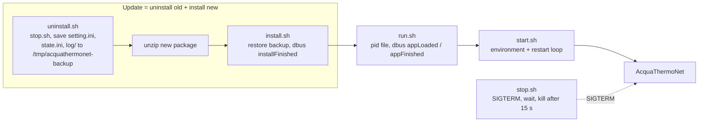

| Script | Role |
|---|---|
| `run.sh` | launcher entry point; starts `start.sh`, pid file `/var/run/acquathermonet-run.pid`, `appLoaded`/`appFinished` dbus notifications |
| `start.sh` | `DISPLAY`, xcb, plugins, `LD_LIBRARY_PATH`; restart loop (exit 0/3 stop it) |
| `stop.sh` | SIGTERM, waits the clean shutdown, kills after 15 s |
| `uninstall.sh` | stop + backup of `setting.ini`, `state.ini`, `log/` |
| `install.sh` | restore of the backup, `showProgress`/`installFinished` |
| `update.sh` | nothing to do (`updateFinished`) |

`package.info`: name and folder `AcquaThermoNet`, version, `executeAsRoot=true`
(watchdog, serial port), `background=false` (full screen HMI).

First install: no `setting.ini` → created from `setting.default.ini` at the
first start; edit it (broker, zones, relays, serial port) and restart.

---

## 20. Testing and simulators

### 20.1 Unit tests

QtTest, no hardware or broker needed, 12 suites (~95 test functions):

| Suite | Covers |
|---|---|
| `tst_config` | ini parsing, defaults, invalid values, state.ini |
| `tst_zonemodel` | setpoint rounding/clamping, debounced save, signals |
| `tst_regulation` | hysteresis, min cycle, sensor timeout, relay feedback, shutdown |
| `tst_frost` | frost conditions and cycle |
| `tst_exercise` | valve exercise schedule and sequence |
| `tst_modbus` | frames, CRC, online/offline |
| `tst_mqttparse` | topic matching, sensor JSON |
| `tst_weather` | wttr.in / met.no parsing, HTTP dates |
| `tst_telegram` | alarm transitions, commands, texts |
| `tst_relaylog` | CSV, monthly files, ON-time sums |
| `tst_logging` | file log and rotation |
| `tst_monoclock` | monotonic clock |

```sh
qmake ../AcquaThermoNet.pro CONFIG+=tests && make -j4 && ./tests/tests
```

`MonoClock::advanceForTest()` moves time forward instead of waiting.

### 20.2 End to end

`tools/e2e.sh <build>/bin_x86_64/AcquaThermoNet` runs the real application
(offscreen) against three local simulators and checks startup, regulation,
setpoint clamp, shutdown, state files, logs, relay log and Telegram (the
token must never appear in the logs). No other instance may be running.

| Simulator | |
|---|---|
| `tools/minibroker.py` | MQTT 3.1.1 broker (QoS 0/1, retain, wildcards, Will, optional TLS); `pub` sub-command |
| `tools/mbsim.py` | 8-relay Modbus board on a pty; `--stuck-on N`, `--drop N`, `--init-on` |
| `tools/minitelegram.py` | Bot API server (`getUpdates`, `sendMessage`); `inject` sub-command |

### 20.3 GUI screenshot

```sh
qmake ../AcquaThermoNet.pro CONFIG+=tools && make -j4
QT_QPA_PLATFORM=offscreen tools/guishot/guishot setting.ini gui.png
```

Needs an ini with at least 5 zones (the image in §10).

---

## 21. Troubleshooting

| Log / symptom | Meaning / action |
|---|---|
| `Another instance of AcquaThermoNet is already running` (exit 3) | another instance owns the device; stop it first |
| `Error open serial port … retry every 10 s` | wrong `[SERIAL] port` or permissions |
| `Modbus answer timeout` | board not answering: wiring, A/B, baud, id 1 |
| `Modbus relay board offline: 3 poll answers missed` | board lost; relays shown unknown |
| `Relay n zone … is 0 expected 1, resend` / `does not follow commands` | relay or board fault, or another master on the bus |
| `Sensor timeout zone … zone OFF` | sensor silent for `sensor_timeout_s`: battery, range, topic name |
| `Invalid sensor data for zone …` | payload without numeric `temperature` or not JSON |
| `MQTT client error: …` | broker address/credentials; see `MQTT TLS error:` lines for TLS |
| `MQTT TLS configuration invalid: not connecting` | unreadable `ca_file`/`cert_file`/`key_file` |
| `SSL handshake failed` (desktop) | OpenSSL 1.1 not preloaded, see §18.5 |
| `Weather request failed` | no internet / DNS; frost protection uses `outdoor_unknown_protect` |
| `Telegram message from a chat not allowed, ignored: chat id N` | add N to `allowed_chats` |
| `Relays OFF not confirmed on exit` | board unreachable during shutdown |
| `Err open /dev/watchdog, watchdog disabled` | normal on the desktop; on the device check root |
| HA shows the entities *unavailable* | `AcquaThermoNet/status` is `offline`: application stopped or disconnected |
| HA entities duplicated after reinstall | `unique_id` changed: fix it in `[MQTT] unique_id` |

---

## 22. Known limitations and backlog

- **One device per broker**: topics (`AcquaThermoNet/…`,
  `homeassistant/climate/<zone>/config`) are not prefixed by the device id.
- **`set_mode`** is handled but not advertised to HA (no `mode_cmd_t`): it
  only sets the reported heat demand, which the regulation overrides on the
  next switch, while the relay is not commanded. Planned with the HA modes
  ("point 10" of the backlog).
- Each zone is a separate HA *device* (identifiers per zone); the discovery
  model string is fixed (`AcquaThermoNet Ver 0.1`).
- UI, log and Telegram texts are English only; `tr()` translation planned.
- To verify on the real device: CA certificates for TLS/HTTPS, JMLauncher
  handling of versions like `2.1.0-<hash>`, `background` flag, serial port
  reopen after `kill -9`.
- Qt 6 port postponed.
