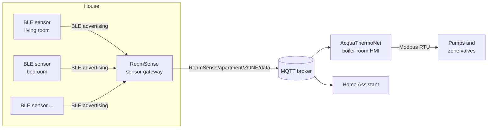
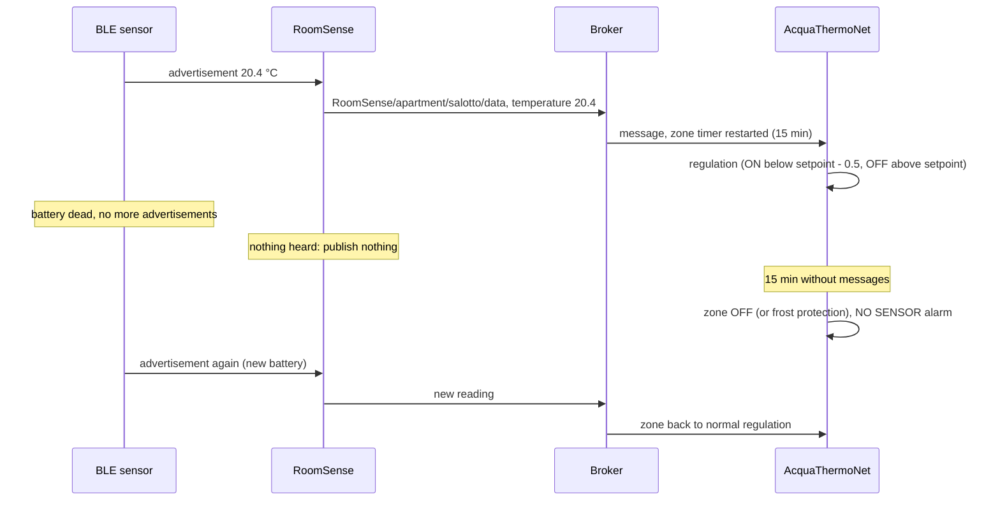

# RoomSense → AcquaThermoNet: MQTT interface specification

This document is for the developer of **RoomSense**, the sensor gateway:
the application that receives the BLE room sensors and publishes their
readings over MQTT (formerly named Thermonator).
It is the complete contract with **AcquaThermoNet**, the heating controller
that drives the boiler room (pumps and zone valves) from those readings.
You do not need the AcquaThermoNet source code: everything the gateway must
do is here.

Interface version: matches AcquaThermoNet **2.2.0** (unchanged since 2.1.0).

---

## 1. Roles



| | RoomSense (sensor gateway) | AcquaThermoNet |
|---|---|---|
| Owns | BLE scanning, decoding, sensor → zone mapping, filtering | zones, setpoints, regulation, relays |
| Publishes | one reading per zone on `RoomSense/apartment/<zone>/data` | its own topics under `AcquaThermoNet/…` (not for the gateway) |
| Subscribes | nothing required | `RoomSense/apartment/#` |

The two applications never talk directly: only through the broker. There is
no request/response, no acknowledgement: the gateway publishes, the
controller consumes. **Home Assistant reads the same topic** to show the
current temperature of each zone (its climate entities point to it).

---

## 2. Contract summary

| Item | Value |
|---|---|
| Protocol | MQTT 3.1.1, same broker as AcquaThermoNet (plain 1883 or TLS 8883) |
| Topic | `RoomSense/apartment/<zone>/data` (fixed prefix, case sensitive) |
| `<zone>` | exactly a zone name configured in AcquaThermoNet (`[ZONES] list`), charset `[A-Za-z0-9_-]` |
| Payload | UTF-8 JSON object, one reading |
| Required field | `temperature` (°C) |
| Optional fields | `humidity`, `battery`, `battmv`, `data_time`, `mac`; extra fields are ignored |
| QoS | 0 or 1 (the controller subscribes at QoS 0) |
| Retain | **false** (see §6) |
| Rate | every 60–300 s per zone; **never** less often than every 15 min |
| Stale data | **stop publishing** a zone whose sensor is no longer heard |

---

## 3. Topic

```
RoomSense/apartment/<zone>/data
```

- `RoomSense/apartment` is a fixed prefix in AcquaThermoNet: use it verbatim.
- `<zone>` must match, **case sensitive**, one of the zone names configured
  in the controller. Today's installation uses:

  | Zone | Room |
  |---|---|
  | `salotto` | living room |
  | `ingresso` | entrance |
  | `cameretta` | small bedroom |
  | `camera` | bedroom |
  | `bagno` | bathroom |

  Confirm the list with whoever configures the controller: the zone names
  are the only shared configuration between the two applications. Make
  them a configuration item of the gateway (sensor MAC → zone name), never
  hard-coded.
- The last level must be `data`. Anything else under
  `RoomSense/apartment/` is ignored by the controller, as are zone names it
  does not know (silently).

**One topic = one zone = one temperature.** If a zone has several sensors,
the gateway decides which value to send (one chosen sensor, average, …):
the controller treats every message on the topic as the room temperature.

---

## 4. Payload

### 4.1 Example

```json
{
  "temperature": 20.4,
  "humidity": 48,
  "battery": 85,
  "battmv": 2950,
  "data_time": 1790596805,
  "mac": "A4:C1:38:12:34:56"
}
```

Minimal valid message:

```json
{"temperature": 20.4}
```

### 4.2 Fields

| Field | Required | JSON type | Unit / range | Used by the controller for |
|---|---|---|---|---|
| `temperature` | **yes** | number, or string with a number (`"20.4"`) | °C, one decimal is enough | regulation, display, Home Assistant |
| `humidity` | no | number or numeric string | %RH, 0–100, stored as integer (decimals dropped) | display |
| `battery` | no | number or numeric string | %, 1–100, integer | display, low battery alarm |
| `battmv` | no | number or numeric string | mV, 0–65535 | stored only |
| `data_time` | no | number or numeric string | Unix epoch seconds (UTC) of the reading | stored only (see §5) |
| `mac` | no | string | sensor address | stored only |

Rules applied by the controller:

- The message must be a **JSON object** with a valid `temperature`,
  otherwise it is rejected and logged (`Invalid sensor data for zone …`).
  A rejected message does **not** refresh the zone.
- Numbers may be JSON numbers or strings containing a number (both
  `20.4` and `"20.4"` work). Prefer JSON numbers.
- An optional field that is missing keeps its previous value. Send all the
  fields you have in every message.
- `battery`: `0` means *unknown* (no alarm). If the battery level is not
  known, **omit** the field rather than sending 0. Below 20 % the controller
  raises a "battery low" alarm (panel and Telegram), cleared from 30 %.
- Unknown extra fields (`rssi`, `sensor_type`, …) are ignored: you may add
  them for Home Assistant or diagnostics.
- Home Assistant extracts the temperature with the template
  `{{ value_json.temperature }}`: keep the field name and top-level
  position.

### 4.3 Plausibility

The controller does **not** range-check the temperature: a decoding error
such as `85.0` or `-40.0` would switch a zone OFF or ON. The gateway must
drop implausible readings instead of publishing them, e.g.:

- outside −20…50 °C;
- a jump of more than ~3 °C from the previous reading of the same sensor
  within a few minutes (unless confirmed by the next reading);
- advertisements that fail the sensor's own checksum/format checks.

Dropping a reading is always safe (see §5); publishing a wrong one is not.

---

## 5. Freshness and sensor loss (safety)

This is the most important part of the contract.

**The controller considers a zone "alive" from the time a message
arrives**, not from `data_time`. Each valid message restarts a timer of
`sensor_timeout_s` (default **900 s = 15 min**) for that zone. When it
expires:

- the zone is switched **OFF** (valve closed) and flagged `NO SENSOR` on
  the panel, with a Telegram alarm;
- if it is cold outside, the zone goes into **frost protection** (heating
  10 min every hour) instead.

The zone comes back to normal regulation with the next valid message.

Consequences for the gateway:

1. **Publish only real, new readings.** If a BLE sensor is no longer
   heard (battery dead, out of range, removed), **stop publishing** for its
   zone. Never republish a cached last value on a timer: the controller
   would keep heating the room on a temperature that no longer exists, and
   the sensor loss would never be detected.
2. **Publish often enough**: at least 3 messages per 15 minutes, so that one
   or two lost BLE advertisements or MQTT messages do not trip the timeout.
   Recommended: one message per zone every **60–300 s**, plus immediately
   when the temperature changes by ≥ 0.1 °C (not more than one message
   every ~10 s per zone).
3. If the gateway restarts, it may take a few minutes to hear all sensors:
   that is fine, the controller tolerates up to 15 min of silence.
4. At controller start-up, a zone never heard is treated as missing only
   after 15 min, so the gateway and the controller can start in any order.



How the controller uses the temperature, for information: heating ON when
the temperature is below *setpoint − 0.5 °C*, OFF above the *setpoint*,
with at least 3 minutes between two switches of the same zone. Readings
more frequent than about one per minute do not improve the regulation.

---

## 6. MQTT settings

| Setting | Value | Why |
|---|---|---|
| Client id | unique and stable, e.g. `RoomSense-<host>` | must not collide with `AcquaThermoNet-…` |
| Credentials / TLS | the broker's; same `ca_file` rules as the controller if TLS | |
| QoS | 0 or 1 | the controller subscribes at QoS 0; QoS 1 only helps up to the broker |
| **Retain** | **false** | a retained reading is delivered again when the controller restarts, and it counts as fresh (§5): a dead sensor would regulate its zone for 15 more minutes on an old value |
| Keepalive | 30–60 s | |
| Reconnect | automatic, with backoff | buffered readings older than ~1 min should be dropped, not sent late |

Recommended (not read by the controller today, useful for diagnostics and
Home Assistant): gateway availability with a Will message.

| Topic | Payload | Retain |
|---|---|---|
| `RoomSense/status` | `online` at connect, `offline` as Will | yes |

Do **not** put it under `RoomSense/apartment/`, and do not publish anything
under `AcquaThermoNet/` or `homeassistant/climate/`: those topics belong to
the controller.

---

## 7. Testing the integration

With `mosquitto_pub` (or the gateway itself), against the real broker:

```sh
# one reading for the living room
mosquitto_pub -h <broker> -u <user> -P <password> \
  -t RoomSense/apartment/salotto/data \
  -m '{"temperature":20.4,"humidity":48,"battery":85}'

# watch what the gateway publishes
mosquitto_sub -h <broker> -u <user> -P <password> -v -t 'RoomSense/#'

# watch the controller reacting (setpoint and heat demand per zone)
mosquitto_sub -h <broker> -u <user> -P <password> -v -t 'AcquaThermoNet/#'
```

What to check:

| Check | Expected result |
|---|---|
| Reading received | panel card of the zone shows the temperature, humidity, battery and `updated now` |
| Below setpoint − 0.5 | `AcquaThermoNet/<zone>/state_mode` becomes `heat`, flame icon red |
| Wrong zone name | nothing happens on the panel (message ignored) |
| Invalid payload (`{"temp":20}`, not JSON) | controller log: `Invalid sensor data for zone …` |
| Battery 15 | card shows `BATTERY LOW 15%`, Telegram alarm |
| Stop the sensor for 15 min | card shows `NO SENSOR`, zone OFF, Telegram alarm |
| Home Assistant | the `clima.<zone>` entity shows the current temperature |

The controller's Telegram bot (`/zone salotto`) also shows the last reading
and how long ago it arrived.

---

## 8. Acceptance checklist for RoomSense

- [ ] Topic `RoomSense/apartment/<zone>/data`, zone names from configuration, exact case
- [ ] JSON object with numeric `temperature` in °C in every message
- [ ] `humidity` and `battery` (1–100 %) sent when known, `battery` omitted when unknown
- [ ] Implausible readings dropped (range, jumps, decode errors)
- [ ] One message per zone every 60–300 s while the sensor is heard
- [ ] **No message** for a zone whose sensor is not heard (no cached republishing)
- [ ] Retain false; no stale buffered readings sent after a reconnect
- [ ] Several sensors in one zone combined into one value by the gateway
- [ ] Own client id; optional `RoomSense/status` availability with Will
- [ ] Nothing published under `AcquaThermoNet/` or `homeassistant/climate/`

---

## 9. Changing the contract

The topic prefix, the field names and the timeout are defined in
AcquaThermoNet (`climatezones.h`, `mqttparse.cpp`, `[REGULATION]
sensor_timeout_s`). Any change on either side (new zone, renamed zone,
different topic or field) must be agreed and made in both applications at
the same time; a new zone also needs its relay configured in the
controller. Full controller documentation: [`DOCUMENTATION.md`](DOCUMENTATION.md).
